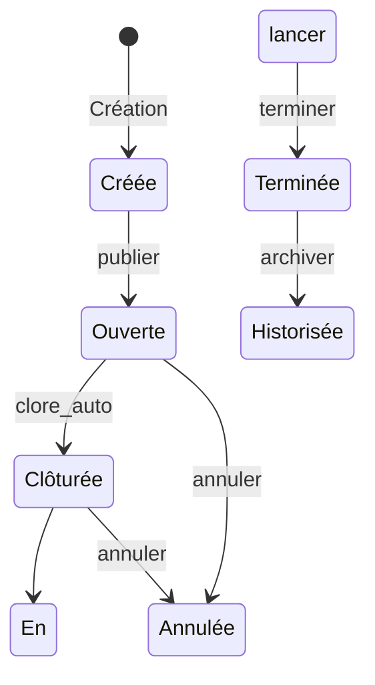

# Workflow des Sorties - ENI-Sortir

## 📋 Vue d'ensemble

Le workflow des sorties est le cœur de l'application ENI-Sortir. Il gère automatiquement le cycle de vie complet d'une sortie, de sa création jusqu'à son archivage.

## 🔄 Machine à états

### États possibles
1. **Créée** : Sortie créée mais pas encore publiée
2. **Ouverte** : Sortie publiée, inscriptions ouvertes
3. **Clôturée** : Inscriptions fermées, sortie prête à démarrer
4. **En cours** : Sortie en cours d'exécution
5. **Terminée** : Sortie terminée
6. **Annulée** : Sortie annulée
7. **Historisée** : Sortie archivée

### Diagramme de workflow



## 🚀 Transitions

### 1. Création → Créée
**Déclencheur** : Création d'une nouvelle sortie
**Conditions** : Utilisateur connecté, formulaire valide

### 2. Créée → Ouverte (publier)
**Déclencheur** : Action manuelle de l'organisateur
**Conditions** : Organisateur ou admin, données complètes

### 3. Ouverte → Clôturée (clore_auto)
**Déclencheur** : Automatique
**Conditions** : Nombre max atteint OU date limite dépassée

### 4. Clôturée → En cours (lancer)
**Déclencheur** : Automatique
**Conditions** : Date de début atteinte

### 5. En cours → Terminée (terminer)
**Déclencheur** : Automatique
**Conditions** : Durée écoulée (si définie)

### 6. Terminée → Historisée (archiver)
**Déclencheur** : Automatique
**Conditions** : 1 mois écoulé depuis la date de début

### 7. Ouverte/Clôturée → Annulée (annuler)
**Déclencheur** : Action manuelle
**Conditions** : Organisateur ou admin, avant le début

## ⚙️ Configuration

Le workflow est configuré dans `config/packages/workflow.yaml` avec :
- États (places)
- Transitions
- Guards de sécurité
- Audit trail

## 🤖 Automatisation

### Commande de traitement
```bash
php bin/console app:sortie:tick
```

### Interface de surveillance
- `/cron` : Visualisation et simulation
- Traitement manuel des transitions
- Logs détaillés

## 📊 Règles métier

### Contraintes temporelles
- Date de début dans le futur
- Date limite < Date de début
- Durée max 24h

### Contraintes de capacité
- 1-100 participants max
- Une inscription par participant
- Clôture automatique

### Contraintes d'annulation
- Avant le début seulement
- Désistement jusqu'à la limite
- Admin peut toujours annuler

## 🔍 Debugging

### Audit trail
Toutes les transitions sont enregistrées automatiquement.

### Logs
Transitions loggées avec détails complets.

### Interface debug
Simulation et exécution manuelle via `/cron`.

## 🧪 Tests

### Tests unitaires
- Transitions individuelles
- Guards de sécurité
- Règles métier

### Tests d'intégration
- Workflow complet
- Scénarios réels
- Performance

## 🚀 Optimisations

### Performance
- Index sur colonnes d'état
- Cache des états
- Traitement par lot

### Scalabilité
- Queue asynchrone (futur)
- Partitioning par période
- Monitoring avancé

## 🔮 Évolutions

### Améliorations prévues
- Notifications automatiques
- Webhooks externes
- Workflow personnalisé
- Historique détaillé

---

*Documentation maintenue à jour avec l'évolution du système.*